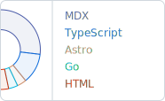
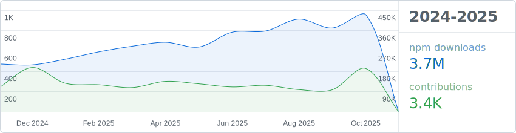

<picture>
  <source media="(prefers-color-scheme: dark)" srcset="assets/languages-dark.svg">
  
</picture>

## Ahoy 👋

- Mostly **TypeScript**, **React** and some **Go**.
- All my projects are available on [GitHub](https://github.com/HiDeoo).
- Check out my [dotfiles](https://github.com/HiDeoo/dotfiles).
- Convert caffeine into code.

 

<picture>
  <source media="(prefers-color-scheme: dark)" srcset="assets/stats-dark.svg">
  
</picture>
